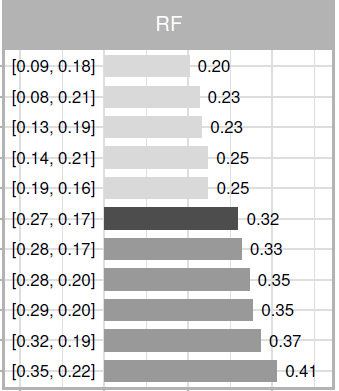

{: style="float: left"}

In August 2020 I completed my PhD on causal inference in economics at ETH Zurich. I am currently looking for a position as a data scientist, data analyst or economist with a strong quantitative focus.

I am very passionate about machine learning, data visualization and causal inference. In one chapter of my PhD thesis, I analyzed how machine learning methods can be applied to estimate causal effects. To illustrate my findings, I created an [interactive web app](https://eliasmoor.shinyapps.io/mlevaluation/) with Shiny. 

For more infos about my PhD thesis and my other projects, please visit my [projects](/projects/) page.

